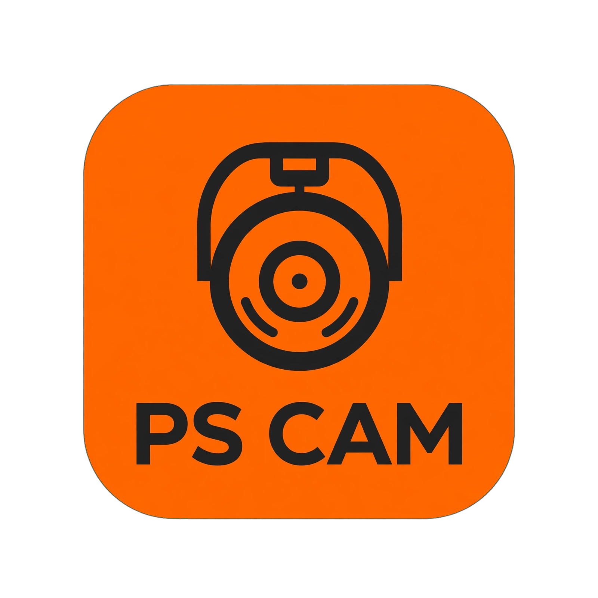

<div align="center">



<br />

# PS Cam · Câmera de Segurança Inteligente

**Transforme qualquer smartphone em uma câmera de segurança com monitoramento em tempo real a partir de outro celular ou computador.**

[](https://react.dev/)
[](https://www.typescriptlang.org/)
[](https://webrtc.org/)
[](https://firebase.google.com/)
[](https://tailwindcss.com/)

</div>

---

## 📌 Visão Geral

O **PS Cam** é uma solução de vigilância e monitoramento de vídeo em tempo real que conecta dois dispositivos diretamente usando tecnologia **WebRTC P2P** e sinalização em nuvem pelo **Firebase**. 

Com ele, você pode reaproveitar um telefone sobressalente como uma câmera de segurança de alto desempenho e assistir a transmissão ao vivo, receber alertas e controlar o dispositivo remotamente a partir do seu telefone principal, tablet ou computador.

---

## 🚀 Principais Funcionalidades

### 📱 1. Modo Câmera (Transmissor)
- **Transmissão em Tempo Real:** Fluxo de vídeo e áudio de baixíssima latência direto para o espectador via WebRTC.
- **Detecção Inteligente de Movimento:** Algoritmo integrado via canvas para identificar alterações no ambiente e alertar o espectador.
- **Controle Remoto de Hardware:**
  - Ligar/desligar lanterna (Flash).
  - Acionar alarme sonoro (Sirene) para afugentar intrusos.
  - Alternar entre câmera frontal e traseira (`user` / `environment`).
  - Alternância de qualidade de vídeo (HD / SD) para economizar dados móveis.
- **Modo Segundo Plano (Black Screen):** Apaga o display com economia de energia e discrição enquanto a câmera continua operando normalmente.
- **Gravação Automática em Segmentos:** Gravação contínua em blocos de 60 segundos com opção de sincronização em nuvem.
- **Prevenção de Suspensão (Wake Lock):** Impede que a tela e o processador do celular durmam durante a transmissão.

### 👁️ 2. Modo Espectador (Monitor / Viewer)
- **Painel de Controle Unificado:** Visualize a transmissão em tela cheia com baixa latência e status de conexão instantâneo.
- **Pareamento Rápido por QR Code:** Aponte a câmera para o QR Code gerado pelo transmissor ou selecione as sessões ativas vinculadas à sua conta.
- **Comandos Instantâneos:** Dispare o flash, acione a sirene ou comute a câmera do dispositivo remoto com um toque.
- **Linha do Tempo de Eventos (Timeline):** Histórico de gravações e clipes salvos para reprodução direta no aplicativo.
- **Comunicação Segura:** Autenticação via Google, E-mail/Senha ou Acesso Anônimo protegido pelo Firebase.

---

## 🛠️ Arquitetura Tecnológica

```
+------------------+         WebRTC Direct P2P (Áudio & Vídeo)        +-------------------+
|                  | ===============================================> |                   |
| Dispositivo A    |                                                  | Dispositivo B     |
| [Modo Câmera]    | < - - - - - - - - - - - - - - - - - - - - - - -  | [Modo Espectador] |
|                  |            Comandos Remotos via Firestore        |                   |
+------------------+                                                  +-------------------+
         ^                                                                      ^
         |                                                                      |
         + - - - - - - - - - - -> [ Firebase Firestore ] < - - - - - - - - - - +
                                   - Sessões Ativas
                                   - Sinalização WebRTC
                                   - Comandos de Hardware
```

- **Frontend:** React 19, TypeScript, Tailwind CSS, Lucide Icons.
- **Streaming:** PeerJS com servidores STUN globais da Google e Twilio.
- **Sinalização & Autenticação:** Firebase Auth e Firestore Database.
- **Scanner & Códigos:** `jsQR` e `react-qr-code`.

---

## 💻 Como Executar o Projeto

### Pré-requisitos
- **Node.js** (versão 18 ou superior)
- Navegador moderno com suporte a WebRTC e `getUserMedia` (Chrome, Safari, Firefox, Edge)

### 1. Clonar e Instalar Dependências
```bash
# Clone o repositório
git clone https://github.com/seu-usuario/ps-cam.git

# Acesse a pasta do projeto
cd ps-cam

# Instale as dependências
npm install
```

### 2. Configurar o Firebase
Certifique-se de que as credenciais do Firebase estejam configuradas no arquivo `firebase.ts` ou nas variáveis de ambiente:

```env
VITE_FIREBASE_API_KEY=sua_api_key
VITE_FIREBASE_AUTH_DOMAIN=seu_projeto.firebaseapp.com
VITE_FIREBASE_PROJECT_ID=seu_projeto_id
VITE_FIREBASE_STORAGE_BUCKET=seu_projeto.appspot.com
VITE_FIREBASE_MESSAGING_SENDER_ID=seu_sender_id
VITE_FIREBASE_APP_ID=seu_app_id
```

### 3. Iniciar o Servidor de Desenvolvimento
```bash
npm run dev
```
O aplicativo estará disponível em: `http://localhost:3000`

---

## 📱 Guia de Uso

1. **Abra o app no primeiro telefone (Câmera):**
   - Conecte-se com sua conta ou modo anônimo.
   - Selecione a opção **"Modo Câmera"**.
   - Conceda as permissões de acesso à Câmera e Microfone.
   - Posicione o telefone no local desejado. Um QR Code será exibido na tela.

2. **Abra o app no segundo telefone ou computador (Espectador):**
   - Acesse com a mesma conta ou use a opção de escanear QR Code.
   - Selecione **"Modo Espectador"**.
   - Aponte para o QR Code da Câmera ou clique na sessão correspondente na lista de câmeras ativas.
   - O vídeo ao vivo será carregado instantaneamente via conexão P2P.

---

## 🔒 Privacidade e Segurança

- **Conexão Direta (P2P):** O fluxo de vídeo e áudio trafega de ponta a ponta diretamente entre os dispositivos via WebRTC, sem passar por servidores de mídia de terceiros.
- **Permissões Granulares:** Somente usuários autorizados na mesma conta ou com a chave de pareamento da sessão podem assistir à transmissão.
- **Armazenamento Seguro:** As credenciais e sessões são protegidas pelas regras do Firebase Firestore.

---

<div align="center">
  <sub>Desenvolvido com foco em alta performance, minimalismo e segurança com <strong>PS Cam</strong>.</sub>
</div>
